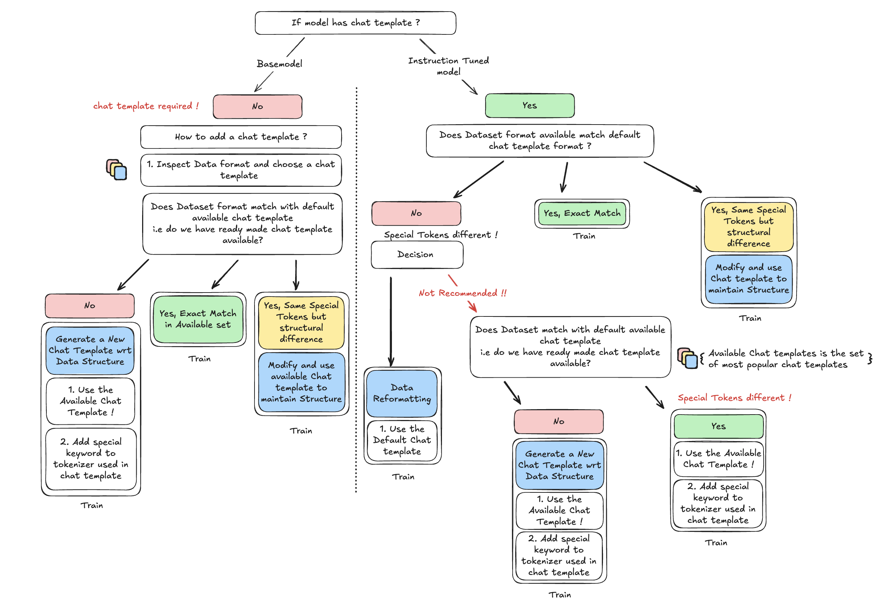

# FMS HF Tuning

- [Installation](#installation)
- [Supported Models](#supported-models)
  - [Supported Vision Language Models](#tuning-vision-language-models)
- [Training and Training Parameter Selection](#training-and-training-parameters)
- [Tuning Techniques](#tuning-techniques)
- [Data format support](#data-support)
  - [Supported Data File Formats](#supported-data-file-formats)
  - [Advanced Data Processing](#advanced-data-preprocessing)
  - [Guidelines on supported data formats](#use-cases-supported-via-command-line-argument-training_data_path)
- [Additional](#additional)
  - [Validation](#validation)
  - [Training controller](#trainer-controller-framework)
  - [More Examples](#more-examples)

This repo provides basic tuning scripts with support for specific models. The repo relies on Hugging Face `SFTTrainer` and PyTorch FSDP. Our approach to tuning is:
1. Models are loaded from Hugging Face `transformers` or the [foundation-model-stack](https://github.com/foundation-model-stack/foundation-model-stack) -- models are either optimized to use `Flash Attention v2` directly or through `SDPA`
2. Hugging Face `SFTTrainer` for the training loop
3. `FSDP` as the backend for training

## Installation

Refer our [Installation](./docs/installation.md) document for details on how to install the library.

## Supported Models

- For each tuning technique, we run testing on a single large model of each architecture type and claim support for the smaller models. For example, with QLoRA technique, we tested on granite-34b GPTBigCode and claim support for granite-20b-multilingual.

- LoRA Layers supported : All the linear layers of a model + output `lm_head` layer. Users can specify layers as a list or use `all-linear` as a shortcut. Layers are specific to a model architecture and can be specified as noted [here](https://github.com/foundation-model-stack/fms-hf-tuning?tab=readme-ov-file#lora-tuning-example)

- Legend:

  ✅ Ready and available 

  ✔️ Ready and available - compatible architecture (*see first bullet point above)

  🚫 Not supported

  ? May be supported, but not tested

Model Name & Size  | Model Architecture | Full Finetuning | Low Rank Adaptation (i.e. LoRA) | qLoRA(quantized LoRA) | 
-------------------- | ---------------- | --------------- | ------------------------------- | --------------------- |
[Granite 4.0 Tiny Preview](https://huggingface.co/ibm-granite/granite-4.0-tiny-preview) | GraniteMoeHybridForCausalLM | ✅**** | ✅**** | ? |
[Granite PowerLM 3B](https://huggingface.co/ibm-research/PowerLM-3b) | GraniteForCausalLM | ✅* | ✅* | ✅* |
[Granite 3.1 1B](https://huggingface.co/ibm-granite/granite-3.1-1b-a400m-base)       | GraniteForCausalLM | ✔️* | ✔️* | ✔️* |
[Granite 3.1 2B](https://huggingface.co/ibm-granite/granite-3.1-2b-base)             | GraniteForCausalLM | ✔️* | ✔️* | ✔️* |
[Granite 3.1 8B](https://huggingface.co/ibm-granite/granite-3.1-8b-base)       | GraniteForCausalLM | ✔️* | ✔️* | ✔️* |
[Granite 3.0 2B](https://huggingface.co/ibm-granite/granite-3.0-2b-base)       | GraniteForCausalLM | ✔️* | ✔️* | ✔️* |
[Granite 3.0 8B](https://huggingface.co/ibm-granite/granite-3.0-8b-base)       | GraniteForCausalLM | ✅* | ✅* | ✔️ |
[GraniteMoE 1B](https://huggingface.co/ibm-granite/granite-3.0-1b-a400m-base)        | GraniteMoeForCausalLM  | ✅ | ✅** | ? |
[GraniteMoE 3B](https://huggingface.co/ibm-granite/granite-3.0-3b-a800m-base)        | GraniteMoeForCausalLM  | ✅ | ✅** | ? |
[Granite 3B Code](https://huggingface.co/ibm-granite/granite-3b-code-base-2k)           | LlamaForCausalLM      | ✅ | ✔️  | ✔️ | 
[Granite 8B Code](https://huggingface.co/ibm-granite/granite-8b-code-base-4k)           | LlamaForCausalLM      | ✅ | ✅ | ✅ |
Granite 13B          | GPTBigCodeForCausalLM  | ✅ | ✅ | ✔️  | 
Granite 20B          | GPTBigCodeForCausalLM  | ✅ | ✔️  | ✔️  | 
[Granite 34B Code](https://huggingface.co/ibm-granite/granite-34b-code-instruct-8k)            | GPTBigCodeForCausalLM  | 🚫 | ✅ | ✅ | 
[Llama3.1-8B](https://huggingface.co/meta-llama/Llama-3.1-8B)          | LlamaForCausalLM               | ✅*** | ✔️ | ✔️ |  
[Llama3.1-70B](https://huggingface.co/meta-llama/Llama-3.1-70B)(same architecture as llama3) | LlamaForCausalLM   | 🚫 - same as Llama3-70B | ✔️  | ✔️ | 
[Llama3.1-405B](https://huggingface.co/meta-llama/Llama-3.1-405B)                            | LlamaForCausalLM   | 🚫 | 🚫 | ✅ | 
[Llama3-8B](https://huggingface.co/meta-llama/Meta-Llama-3-8B)                               | LlamaForCausalLM   | ✅ | ✅ | ✔️ |  
[Llama3-70B](https://huggingface.co/meta-llama/Meta-Llama-3-70B)                             | LlamaForCausalLM   | 🚫 | ✅ | ✅ |
aLLaM-13b                                 | LlamaForCausalLM |  ✅ | ✅ | ✅ |
[Mixtral 8x7B](https://huggingface.co/mistralai/Mixtral-8x7B-v0.1)                              | MixtralForCausalLM   | ✅ | ✅ | ✅ |
[Mistral-7b](https://huggingface.co/mistralai/Mistral-7B-v0.1)                                  | MistralForCausalLM   | ✅ | ✅ | ✅ |  
Mistral large                             | MistralForCausalLM   | 🚫 | 🚫 | 🚫 | 

(*) - Supported with `fms-hf-tuning` v2.4.0 or later.

(**) - Supported for q,k,v,o layers . `all-linear` target modules does not infer on vLLM yet.

(***) - Supported from platform up to 8k context length - same architecture as llama3-8b.

(****) - Experimentally supported. Dependent on stable transformers version with PR [#37658](https://github.com/huggingface/transformers/pull/37658) and accelerate >= 1.3.0.

### Supported vision model

We also support full fine-tuning and LoRA tuning for vision language models - `Granite 3.2 Vision`, `Llama 3.2 Vision`, and `LLaVa-Next` from `v2.8.1` onwards.
For information on supported dataset formats and how to tune a vision-language model, please see [this document](./docs/vision-language-model-tuning.md).

Model Name & Size  | Model Architecture | LoRA Tuning | Full Finetuning |
-------------------- | ---------------- | --------------- | --------------- |
Llama 3.2-11B Vision  | MllamaForConditionalGeneration | ✅ | ✅ |
Llama 3.2-90B Vision  | MllamaForConditionalGeneration | ✔️ | ✔️ |
Granite 3.2-2B Vision  | LlavaNextForConditionalGeneration | ✅ | ✅ |
Llava Mistral 1.6-7B  | LlavaNextForConditionalGeneration | ✅ | ✅ |
Llava 1.6-34B  | LlavaNextForConditionalGeneration | ✔️ | ✔️ |
Llava 1.5-7B  | LlavaForConditionalGeneration | ✅ | ✅ |
Llava 1.5-13B  | LlavaForConditionalGeneration | ✔️ | ✔️ |

**Note**:
* vLLM currently does not support inference with LoRA-tuned vision models. To use a tuned LoRA adapter of vision model, please merge it with the base model before running vLLM inference.

## Training and Training Parameters:

Please refer our [document](./docs/training.md) to see how to start [Single GPU](./docs/training.md#single-gpu) or [Multi GPU]((./docs/training.md#multi-gpu) runs with fms-hf-tuning.

You can also refer the same [document](./docs/training.md#tips-on-parameters-to-set) on how to use various training arguments.

## Tuning Techniques:

Please refer to our [Tuning document](./docs/tuning-techniques.md) for details on how to perform - 
* [LoRA](./docs/tuning.md#lora-tuning-example)
* [Activated LoRA](./docs/tuning.md#activated-lora-tuning-example)
* [GPTQ-LoRA](./docs/tuning.md#gptq-lora-with-autogptq-tuning-example) 
* [Full Fine Tuning](./docs/tuning.md#fine-tuning)
* [Use FMS Acceleration](./docs/tuning.md#fms-acceleration)
* [Extended Pre-Training](./docs/tuning.md#extended-pre-training)

## Data Support
Users can pass training data as either a single file or a Hugging Face dataset ID using the `--training_data_path` argument along with other arguments required for various [use cases](#use-cases-supported-with-training_data_path-argument) (see details below). If user choose to pass a file, it can be in any of the [supported formats](#supported-data-formats). Alternatively, you can use our powerful [data preprocessing backend](./docs/advanced-data-preprocessing.md) to preprocess datasets on the fly.

Below, we mention the list of supported data usecases via `--training_data_path` argument. For details of our advanced data preprocessing see more details in [Advanced Data Preprocessing](./docs/advanced-data-preprocessing.md).

EOS tokens are added to all data formats listed below (EOS token is appended to the end of each data point, like a sentence or paragraph within the dataset), except for pretokenized data format at this time. For more info, see [pretokenized](#4-pre-tokenized-datasets).

## Supported Data File Formats
We support the following file formats via `--training_data_path` argument

Data Format | Tested Support
------------|---------------
JSON        |   ✅
JSONL       |   ✅
PARQUET     |   ✅
ARROW       |   ✅

As iterated above, we also support passing a HF dataset ID directly via `--training_data_path` argument.

**NOTE**: Due to the variety of supported data formats and file types, `--training_data_path` is handled as follows:
- If `--training_data_path` ends in a valid file extension (e.g., .json, .csv), it is treated as a file.
- If `--training_data_path` points to a valid folder, it is treated as a folder.
- If neither of these are true, the data preprocessor tries to load `--training_data_path` as a Hugging Face (HF) dataset ID.

### Advanced data preprocessing

For advanced users who want to use advanced data preprocessing including mixing and custom preprocessing of datasets please see [this document](./docs/advanced-data-preprocessing.md).

### Use cases supported via command line argument `training_data_path`

For basic users who want to pass command line argument directly to our stack you can refer to the following supported data formats.

### 1. Data formats with a single sequence and a specified response_template to use for masking on completion.

#### 1.1 Pre-process the dataset
 Pre-process the dataset to contain a single sequence of each data instance containing input + response. The trainer is configured to expect a `response template` as a string. For example, if one wants to prepare the `alpaca` format data to feed into this trainer, it is quite easy and can be done with the following code.

```python
PROMPT_DICT = {
    "prompt_input": (
        "Below is an instruction that describes a task, paired with an input that provides further context. "
        "Write a response that appropriately completes the request.\n\n"
        "### Instruction:\n{instruction}\n\n### Input:\n{input}\n\n### Response:"
    ),
    "prompt_no_input": (
        "Below is an instruction that describes a task. "
        "Write a response that appropriately completes the request.\n\n"
        "### Instruction:\n{instruction}\n\n### Response:"
    ),
}

def format_alpaca_fn(example):
    prompt_input, prompt_no_input = PROMPT_DICT['prompt_input'], PROMPT_DICT['prompt_no_input']
    output = prompt_input.format_map(example) if example.get("input", "") != "" else prompt_no_input.format_map(example)
    output = f"{output} {example['output']}"
    return {"output": output}

ds = datasets.load_dataset('json', data_files='./stanford_alpaca/alpaca_data.json')

alpaca_ds = ds['train'].map(format_alpaca_fn, remove_columns=['instruction', 'input'])
alpaca_ds.to_json("sft_alpaca_data.json")
```

The `response template` corresponding to the above dataset and the `Llama` tokenizer is: `\n### Response:"`.

The same way can be applied to any dataset, with more info can be found [here](https://huggingface.co/docs/trl/main/en/sft_trainer#format-your-input-prompts).

Once the data is converted using the formatting function, pass the `dataset_text_field` containing the single sequence to the trainer. 

#### 1.2 Format the dataset on the fly
   Pass a dataset and a `data_formatter_template` to use the formatting function on the fly while tuning. The template should specify fields of the dataset with `{{field}}`. While tuning, the data will be converted to a single sequence using the template. Data fields can contain alpha-numeric characters, spaces and the following special symbols - "." , "_", "-".  

Example: Train.json
`[{ "input" : <text>,
    "output" : <text>,
  },
 ...
]`  
data_formatter_template: `### Input: {{input}} \n\n## Label: {{output}}`  

Formatting will happen on the fly while tuning. The keys in template should match fields in the dataset file. The `response template` corresponding to the above template will need to be supplied. in this case, `response template` = `\n## Label:`.

##### In conclusion, if using the reponse_template and single sequence, either the `data_formatter_template` argument or `dataset_text_field` needs to be supplied to the trainer.

### 2. Dataset with input and output fields (no response template)

  Pass a [supported dataset](#supported-data-formats) containing fields `"input"` with source text and `"output"` with class labels. Pre-format the input as you see fit. The output field will simply be concatenated to the end of input to create single sequence, and input will be masked.

  The `"input"` and `"output"` field names are mandatory and cannot be changed. 

Example: For a JSON dataset like, `Train.jsonl`

```
{"input": "### Input: Colorado is a state in USA ### Output:", "output": "USA : Location"} 
{"input": "### Input: Arizona is also a state in USA ### Output:", "output": "USA : Location"}
```

### 3. Chat Style Single/Multi turn datasets

  Pass a dataset containing single/multi turn chat dataset. Your dataset could follow this format:

```
$ head -n 1 train.jsonl
{"messages": [{"content": "You are an AI language model developed by IBM Research. You are a cautious assistant. You carefully follow instructions. You are helpful and harmless and you follow ethical guidelines and promote positive behavior.", "role": "system"}, {"content": "Look up a word that rhymes with exist", "role": "user"}, {"content": "I found a word that rhymes with \"exist\":\n1\\. Mist", "role": "assistant"}], "group": "lab_extension", "dataset": "base/full-extension", "metadata": "{\"num_turns\": 1}"}
```

This format supports both single and multi-turn chat scenarios.

The chat template used to render the dataset will default to `tokenizer.chat_template` from the model's tokenizer configuration. This can be overridden using the `--chat_template <chat-template-string>` argument. For example, models like [ibm-granite/granite-3.0-8b-instruct](https://huggingface.co/ibm-granite/granite-3.0-8b-instruct), which include a [chat template](https://huggingface.co/ibm-granite/granite-3.0-8b-instruct/blob/e0a466fb25b9e07e9c2dc93380a360189700d1f8/tokenizer_config.json#L188) in their `tokenizer_config.json`, do not require users to provide a chat template to process the data.

Users do need to pass `--response_template` and `--instruction_template` which are pieces of text representing start of
`assistant` and `human` response inside the formatted chat template.
For the [granite model above](https://huggingface.co/ibm-granite/granite-3.0-8b-instruct/blob/main/tokenizer_config.json#L188) for example, the values shall be.
```
--instruction_template "<|start_of_role|>user<|end_of_role|>"
--response_template "<|start_of_role|>assistant<|end_of_role|>"
```

The code internally uses [`DataCollatorForCompletionOnlyLM`](https://github.com/huggingface/trl/blob/main/trl/trainer/utils.py#L93) to perform masking of text ensuring model learns only on the `assistant` responses for both single and multi turn chat.

#### Aligning dataset formats
In some cases the chat template might not be aligned with the data format of the dataset. For example, consider the following data sample and suppose we want to use the list of contents associated with the `messages` key from the data sample for our multi-turn training job!

```
{
  "messages": [
    {"content": "You are an AI...", "role": "system"},
    {"content": "Look up a word...", "role": "user"},
    {"content": "A word that rhymes is 'mist'", "role": "assistant"}
  ],
  "group": "lab_extension",
  "dataset": "base/full-extension",
  "metadata": "{\"num_turns\": 2}"
}
```
Different Chat templates support different data formats and the chat template might not always align with the data format of the dataset!

Here is a example of chat template that iterates over the nested data sample by addressing the "messages" key in `for message in messages['messages']` :
```
\
  {{ '<|user|>\n' + message['content'] + eos_token }}\
  {{ '<|system|>\n' + message['content'] + eos_token }}\
  {{ '<|assistant|>\n'  + message['content'] + eos_token }}\
  \
  {{ '<|assistant|>' }}\
  \

```
While the above template might be suitable for certain data formats, not all chat templates access the nested contents in a data sample.

In the following example notice the `for message in messages` line which does not access any nested contents in the data and expects the nested content to be passed directly to the chat template!

```
\
  \
  {{- '<|system|>\n' + message['content'] + '\n' }}\
  \
  {{- '<|user|>\n' + message['content'] + '\n' }}\
  \
  \
  {{- '<|assistant|>\n'  + message['content'] + eos_token + '\n' }}\
  \
  {{- '<|assistant|>\n'  + message['content'] + eos_token }}\
  \
  \
  \
  {{- '<|assistant|>\n' }}\
  \

```

When working with multi-turn datasets, it's often necessary to extract specific fields from the data depending on the format. For example, in many multi-turn datasets, conversations may be stored under a dedicated key (e.g., `conversations`, `messages`, etc), and you may only need the content of that key for processing.

```
{
  "conversations": [
    {"content": "You are an AI...", "role": "system"},
    {"content": "Look up a word...", "role": "user"},
    {"content": "A word that rhymes is 'mist'", "role": "assistant"}
  ],
  "group": "lab_extension",
  "dataset": "base/full-extension",
  "metadata": "{\"num_turns\": 2}"
}

```
To extract and use the conversations field, pass the following flag when running:
```
--dataset_conversation_field "conversations"
``` 

*Note:* For most cases, users using `Granite3.1+ Instruct` series models which already contain chat template should look to pass `--dataset_conversation_field "messages"` while using multi-turn data on the commandline or use `conversations_column` argument in the [data handler](https://github.com/foundation-model-stack/fms-hf-tuning/blob/30ceecc63f3e2bf3aadba2dfc3336b62187c240f/tests/artifacts/predefined_data_configs/mt_data_granite_3_1B_tokenize_and_mask_handler.yaml#L63) which processes chat template 

We recommend inspecting the data and chat template to decide if you need to pass this flag.

### Guidelines

Depending on various scenarios users might need to decide on how to use chat template with their data or which chat template to use for their use case.  

Following are the Guidelines from us in a flow chart :  
  

Here are some scenarios addressed in the flow chart:  
1. Depending on the model the tokenizer for the model may or may not have a chat template  
2. If the template is available then the `json object schema` of the dataset might not match the chat template's `string format`
3. There might be special tokens used in chat template which the tokenizer might be unaware of, for example `<|start_of_role|>` which can cause issues during tokenization as it might not be treated as a single token  


#### Add Special Tokens
Working with multi-turn chat data might require the tokenizer to use a few new control tokens ( ex: `<|assistant|>`, `[SYS]` ) as described above in the guidelines. These special tokens might not be present in the tokenizer's vocabulary if the user is using base model.

Users can pass `--add_special_tokens` argument which would add the required tokens to the tokenizer's vocabulary.  
For example required special tokens used in `--instruction_template`/`--response_template` can be passed as follows:

```
python -m tuning.sft_trainer \
...
--add_special_tokens "<|start_of_role|>" "<|end_of_role|>" \
--instruction_template "<|start_of_role|>user<|end_of_role|>" \
--response_template "<|start_of_role|>assistant<|end_of_role|>"
```

### 4. Pre tokenized datasets.

Users can also pass a pretokenized dataset (containing `input_ids` and `labels` columns) as `--training_data_path` argument e.g.

At this time, the data preprocessor does not add EOS tokens to pretokenized datasets, users must ensure EOS tokens are included in their pretokenized data if needed.

```
python tuning/sft_trainer.py ... --training_data_path twitter_complaints_tokenized_with_maykeye_tinyllama_v0.arrow
```

## Offline Data Preprocessing

We also provide an interface for the user to perform standalone data preprocessing. This is especially useful if:

1. The user is working with a large dataset and wants to perform the processing in one shot and then train the model directly on the processed dataset.

2. The user wants to test out the data preprocessing outcome before training.

Please refer to [this document](docs/offline-data-preprocessing.md) for details on how to perform offline data processing.

## Additional Frameworks

### Validation

For examples on how to run inference on models trained via fms-hf-tuning see [Inference](./docs/tuning.md#inference) document.

We can use [`lm-evaluation-harness`](https://github.com/EleutherAI/lm-evaluation-harness) from EleutherAI for evaluating the generated model. For example, for the Llama-13B model, using the above command and the model at the end of Epoch 5, we evaluated MMLU score to be `53.9` compared to base model to be `52.8`.

How to run the validation:
```bash
pip install -U transformers
pip install -U datasets
git clone https://github.com/EleutherAI/lm-evaluation-harness
cd lm-evaluation-harness
pip install -e .
python main.py \ 
--model hf-causal \
--model_args pretrained=$MODEL_PATH \ 
--output_path $OUTPUT_PATH/results.json \ 
--tasks boolq,piqa,hellaswag,winogrande,arc_easy,arc_challenge,hendrycksTest-*
```

The above runs several tasks with `hendrycksTest-*` being MMLU.

### Trainer Controller Framework

Trainer controller is a framework for controlling the trainer loop using user-defined rules and metrics. For details about how you can use set a custom stopping criteria and perform custom operations, see [examples/trainercontroller_configs/Readme.md](examples/trainercontroller_configs/Readme.md)

### More Examples
A good simple example can be found [here](examples/kfto-kueue-sft-trainer.yaml) which launches a Kubernetes-native `PyTorchJob` using the [Kubeflow Training Operator](https://github.com/kubeflow/training-operator/) with [Kueue](https://github.com/kubernetes-sigs/kueue) for the queue management of tuning jobs.
