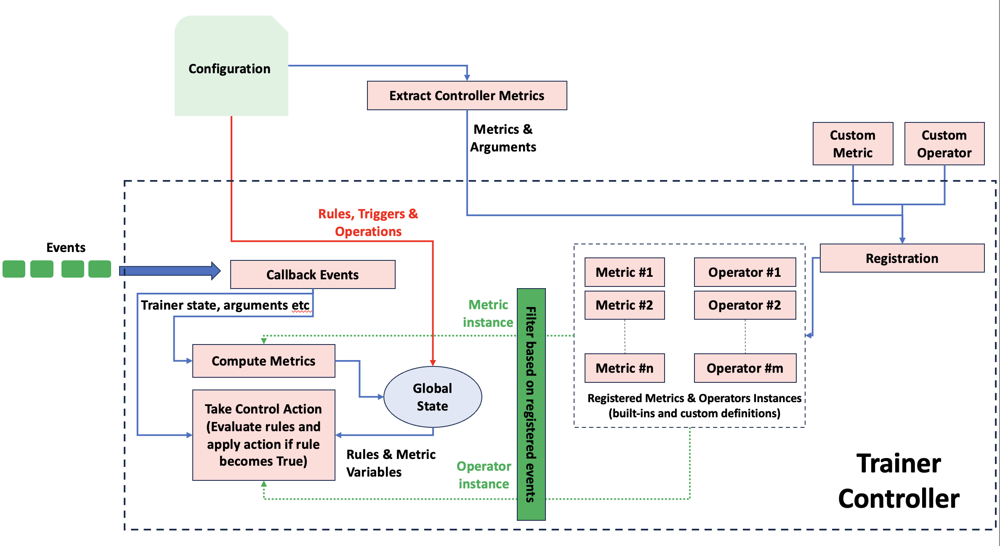

# Trainer Controller Framework

**Deciders(s)**:  Alexander Brooks (alex.brooks@ibm.com), Sukriti Sharma (sukriti.sharma4@ibm.com), Raghu Ganti (rganti@us.ibm.com), Padmanabha Venkatagiri Seshadri (seshapad@in.ibm.com), Dushyant Behl (dushyantbehl@in.ibm.com)
**Date (YYYY-MM-DD)**:  2024-03-05
**Obsoletes ADRs**:  NA
**Modified By ADRs**:  NA
**Relevant Issues**: [537](https://github.ibm.com/ai-foundation/watson-fm-stack-tracker/issues/537), [323](https://github.ibm.com/ai-foundation/watson-fm-stack-tracker/issues/323)

- [Summary and Objective](#summary-and-objective)
  - [Motivation](#motivation)
  - [User Benefit](#user-benefit)
- [Decision](#decision)
  - [Alternatives Considered](#alternatives-considered)
- [Consequences](#consequences)
- [Detailed Design](#detailed-design)

## Summary and Objective

To create a framework for controlling the trainer loop using user-defined rules and metrics.

### Motivation

- The issue [537](https://github.ibm.com/ai-foundation/watson-fm-stack-tracker/issues/537), had raised the need for stopping an ongoing training if some stopping criteria is satisfied (E.g loss validation reaching a certain target, loss increasing with epoch, loss values for last 100 steps increasing etc). 
- There is a [EarlyStoppingCallback](https://github.com/huggingface/transformers/blob/v4.37.2/src/transformers/trainer_callback.py#L543) in HF, but the granularity of stopping is only on `evaluate` events, and handles only compares instantaneous metric value to a threshold.
- Therefore, there is a need for a mechanism to capture the user-defined custom stopping criteria which could involve multiple metrics.
- In addition to user-defined stopping criteria, there could other types of control operations with respect to training (for instance, should the trainer perform saving, logging or evaluation operations or not, should we scale resources dynamically so that training could run faster and so on). Therefore, there is a need for general need to capture all these use-cases in a single framework. This PR attempts to provide such a framework.

### User Benefit

Users could control the training loop by defining custom rules. This will benefit the user in terms of conserving resources by killing training jobs with run-away loss, help in collecting debugging data (log-on-demand), checkpoint-on-demand, and similar scenarios where intervention is required with respect to training loop.

## Decision

### Alternatives Considered

We considered some of the following alternatives:
- Defining the metrics as functions instead of classes. This was dropped because it was less expressive and did not preserve state of the computation (as in the case of windowing mechanisms), which could be updated more efficiently using the evolving logs.
- Making modification to the trainer loop directly instead of using callbacks. This was dropped because it will require custom huggingface stack with the said modifications. Further, it will make the framework tightly coupled.

## Consequences

Following are the advantages and limitations of our design approach:

### Advantages:
- We have used the trainer callback approach which can used in `plug-and-play` form with the trainer. In addition, we have designed this framework to be a independent packaged
- The rules and metrics are flexible and can be defined by user easily with limited coding effort (only in the case of custom metrics), and no coding effort if the user is using existing metrics.

### Impact on performance:
Could add to the overhead of the trainer loop as the callback is invoked at various events of the trainer loop and what is computed within the callback could affect the performance of the loop iteration.


## Detailed Design

### Usage and customization
We have implemented a trainer callback (see [here](https://huggingface.co/docs/transformers/v4.37.2/en/main_classes/callback)) which accepts a `training control definition` file (in YAML format) which facilitates the definition of:
1. Rules to control training loop
2. Trigger points that evaluate the above rules
3. Control operation and action that needs to be performed if rule is evaluated to true.

The trainer controller configuration is structured as shown below. There are list of metric definitions under `controller-metrics`, a list of operations and their actions under `operations` and a list of controllers, each of which define the rules, triggers and control operations.
```
controller-metrics:
  <controller-name>:
    <controller-handler-class>:
      <arg1>: <value>
      ...
operations:
  <operation-name>:
    <operation-handler-class>:
      <arg1>: <value>
      ...
controllers:
  - name: <controller-name>
    triggers:
      - <event-1>
      ...
    rule: <rule-string>
    operations:
      - <operation-action-1>
      ...
```
The `controller-metrics` and `operations` are optional. We provide a set of built-in `controller-metrics` and `operations` which could be referred to without actually defining them as. For example, the below configuration defines a `controller-metric` called `loss` which refers to a built-in `Loss` controller-metric class with custom arguments (in this case, no arguments), but does not define any `operations`. It only refers to a built-in operation.
```
controller-metrics:
  loss:
    Loss:
controllers:
  - name: loss-controller
    triggers:
      - on_log
    rule: loss < 1.0
    operations:
      - hfcontrols.should_training_stop
 ```
For defining custom handler classes, we have an interface defined as an abstract class as shown below, with two abstract methods, namely: `validate()` to define the validation conditions, and `compute()` to compute the metric. The `compute()` returns an `Any` type. While it could be any value, developers should keep in mind that it should be only key-value pairs that are used in the rule(s) defined in the configuration.

Further, the `init` method of the class should accept variable arguments in the form of key-value pairs. `Important point to note is that keys used in the arguments of the above config should not conflict with any keys used by Hugging face trainer callback. Please try to use unique keys are arguments name`.
  ```
  class MetricHandler(metaclass=abc.ABCMeta):
      @abc.abstractmethod 
      def validate(self) -> bool:
          pass

      @abc.abstractmethod 
      def compute(self, event_name: str, **kwargs) -> Any:
          pass
  ```
These classes can be user-defined. To add a new metric class, simply implement the above structure and register it with the trainer controller framework using the `register_metric_handlers()` method. To use the metric handler class,  add the class name, arguments to the above configuration file.

Similarly, there is an operator abstract class `Operation` which could be inherited and custom operations could be defined as illustrated below:
```
class CustomOperation(Operation):
    def should_perform_action_xyz(args):
        pass
```
Every action defined in the custom operation should be represented as a function with `"should_"` prefixed in the function name. The controller will automatically pickup these functions and invoke them if they are referred to in the configuration. Custom operations could be registered using  `register_operation_handlers()` method.

`rule` is python expression which could express a condition to evaluate on a metric variable. For example, in the above configuration, `loss` is the variable, and the rule is applying a threshold on it.

`operations` lists the operation-actions to be performed when the rule evaluates to True. The convention followed to refer to an operation is `<operation-name>.<action-name>`. In this example, the `<operation-class-name>` is referring to built-in operation `hfcontrols` and one of its corresponding action `action-name` i.e `should_training_stop`.

### High-level architecture
Following is a high-level design diagram. Following are the touch-points to the framework through which user of this framework could interact with it:
- **Registration**: The registration mechanism de-couples the metrics and operators from the trainer framework. A user could implement a custom metric or operator and register it through the registration methods mentioned previously. This makes the framework highly extensible.

- **Configuration**: The trainer controller configuration supplies the definition for triggers, rule, operations and metrics to orchestrate the enactment of a particular control policy. These details are split up and passed off to the respective modules by the trainer controller as shown in the figure.

- **Events**: Events supply the state and arguments required for the metric handlers to perform metric computation at the events they are registered for. The framework callback lists out all event handlers with prefix `"on_"` and loads then as event handlers. Every metric declares one or more events from this list of valid handlers. These computed metric variables are stored in a global state of the trainer controller and independently picked up the operations which could potentially be triggered on an entirely different set of events. This decouples the control loop for metrics and operations. I.e. the metric could be computed on event A, while operation could be triggered on event B. The controller rules which use the metric variables from the trainer controller state are evaluated and based on the outcomes specified actions are performed.
