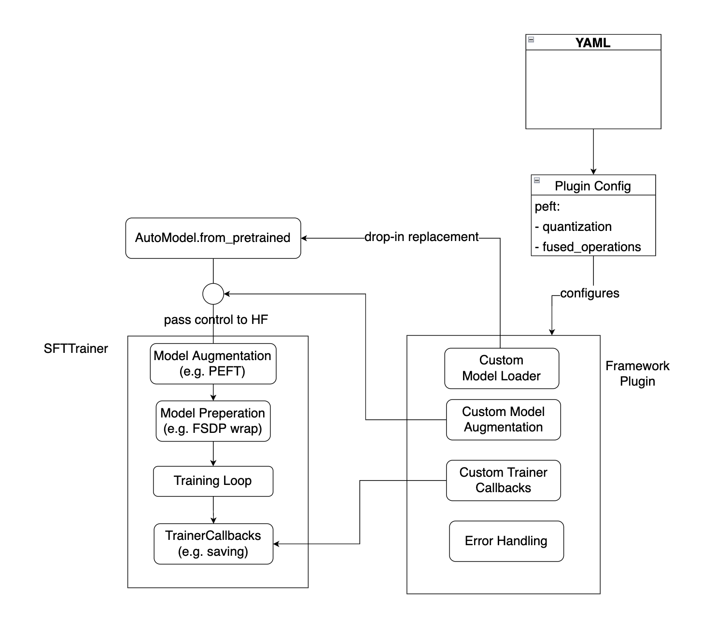

# Training Enhancements Framework

**Deciders(s)**: Sukriti Sharma (sukriti.sharma4@ibm.com), Raghu Ganti (rganti@us.ibm.com), Laura Wynter (lwynter@sg.ibm.com), Fabian Lim (flim@sg.ibm.com), Aaron Chew (aaron.chew1@ibm.com)
**Date (YYYY-MM-DD)**:  2024-04-11
**Obsoletes ADRs**:  NA
**Modified By ADRs**:  NA
**Relevant Issues**: [116](https://github.com/foundation-model-stack/fms-hf-tuning/pull/116)

- [Summary and Objective](#summary-and-objective)
  - [Motivation](#motivation)
  - [User Benefit](#user-benefit)
- [Decision](#decision)
  - [Alternatives Considered](#alternatives-considered)
- [Consequences](#consequences)
- [Detailed Design](#detailed-design)

## Summary and Objective

Design and implement a framework to include custom acceleration tools into `sft_trainer.py`, that improve training metrics such as GPU memory consumption, training speed, etc.

<!--
Context goes here.

Describe the forces at play, including technological, political, social, and project local. These forces are likely in tension, and should be called out as such. The language in this section is value-neutral. It is simply describing facts.
-->

### Motivation

Recently, it has been observed that new training techniques are released with an incomplete "preview" version. These "preview" versions tend to be not be fully integrated into OSS. Therefore, using new techniques typically involve additional work. This framework aims to allow timely integrations of such techniques into `sft_trainer.py`, to enable:
* developers to integrate open-source training improvements into `sft_trainer.py`.
* researchers to implement custom training improvements into `sft_trainer.py`.
* users to easily pick and choose which said training improvements to enable when using `sft_trainer.py`.

The framework that we propose must be extensible. We propose 3 strong candidates for to be implemented in the near future, but over time new improvements will be available (from open source or from internal development). When a new improvement is added, it should be done in a manner that is minimally intrusive to `sft_trainer.py`.

#### Training Improvements planned for Integration into Framework

The following 3 techniques are currently under strong consideration to be added. In what follows, we explain clearly why these techniques are currently available out-of-the-box from huggingface `SFTTrainer`, to motivate why they need to be added as improvements:
- [AutoGPTQ](https://github.com/AutoGPTQ/AutoGPTQ).
    * AutoGPTQ is available only via basic integration through [huggingface optimum](https://github.com/huggingface/optimum). 
    * AutoGPTQ provides state-of-the-art, 4-bit quantized PEFT-LoRA that greatly reduces memory requirements base weights.
    * Unfortunately, huggingface integrated [GPTQ kernels that do not work in training](https://github.com/AutoGPTQ/AutoGPTQ/issues/633).
    * Therefore, a training improvement is planned to properly integrate the [latest triton V2 kernels](https://github.com/AutoGPTQ/AutoGPTQ/pull/596) that can be used for sped-up PEFT training.
- [Unsloth](https://github.com/unslothai/unsloth).
    * Unsloth is a collection of kernels and fused operations that improve PEFT-LoRA. 
    * Unfortunately, unsloth's codebase contains also a lot of reatures (e.g., fused attention, gradient checkpointing) that we do not want integrated at this moment.
    * Thefore, a training improvement is planned to incorporate a clean integration of unsloth, that extracts out only the critical code pieces.
- [megablocks](https://github.com/databricks/megablocks).
    * Megablocks is a collection of distributed training methods to speed up mixture-of-experts training.
    * Megablocks is procured by [databricks](https://github.com/databricks/megablocks), and there is no indication it will be integrated into `SFTTrainer`.
    * Therefore, a training improvement is under strong consideration, to be added to allow a model with a mixture-of-experts layer, to be sped-up using megablocks techniques.

<!--
Why this is a valuable problem to solve? What background information is needed to show how this design addresses the problem?

Which users are affected by the problem? Why is it a problem? What data supports this? What related work exists?
-->

### User Benefit

Users will benefit from powerful training tools integrated into the platform, that are not readily accessible from huggingface. With these tools, users will be able to train models with less GPU resources and/or quicker, resulting in quicker turnaround and improved user experience. 

<!--
How will users (or other contributors) benefit from this work? What would be the headline in the release notes or blog post?
-->

## Decision

Terminology | Description
--|--
Maintainer | Developers of `sft_trainer.py`.
Framework | an extensible `Framework` managing all implemented methods.
Framework Plugin | Self-contained implementation of a framework method.

The proposal satisfies the following desiredata:
- Unified configuration YAML for all plugins. Fine configuration details abstracted away from Maintainers and other plugin developers.
- Modular design allows new methods plugins to be added / removed / deactivated seemlessly.
- Modular design enforces that plugins interact with `sft_trainer.py` at controlled points, and throw appropriate exceptions.
- Generic enough for most use cases of interest (e.g., quantization, distributed training, etc).
- Unobstrusive design that only *modifies the model*, and leaves `SFTTrainer` unmodified. Minimal inversion-of-control maintained through `TrainerCallbacks`.

### Only the Model is Modified

The `Trainer` is designed to work with generic pytorch models; `trl.SFTTrainer` inherits from `Trainer` and has sligthly more constraints (such as throwing errors if `tokenizer=None`), but are still bare minimum. With this, we claim that modifying the model is much less intrusive to the training pipeline, then say, modifying `SFTTrainer` itself. The hope is then if we constrain ourselves to modify only the model, that we can implement all the method plugins (e.g., quantization, distributed training, etc) that we hope for. 

The framework is designed to only modify them model at two integration points in `sft_trainer.py`. The primary motivation for this is easy code maintenance:
1. an *optional* `model_loader` method that acts as a drop-in replacement for `AutoModel.from_pretrained`. 
2. an *optional* `agumentation` method that provides a way to perform *minor* adjustments to an already instantiated model 
3. an *optional* `callback` method to install `TrainerCallbacks` (if needed, e.g. custom save logic).

In what follows, we provide:
- a description of an abstract base class that all plugins must inherit and conform to.
- a brief description of the framework class that is responsible for managing plugins (e.g., loading, executing).

NOTE: We want to note that the implementation of frameworks and plugins may be moved to a separate open source repository . fms-hf-tuning will then include the framework library as an optional dependency and call respective loaders and augmentation techniques as specified. 

#### AccelerationPlugin Base Class

Implement concrete plugins that inherit below abstract `AccelerationPlugin` class. 
* See also [concrete plugin implementation that loads quantized model (using AutoGPTQ) for LoRA training](#detailed-design).
* Even though all 3 methods are optional, at least one should be implemented.

```python

# data class to hold data and pointer to registered plugins
@dataclass
class PluginRegistration:
    plugin: "AccelerationPlugin"
    configuration_paths: List[str] # path 

# global object to store all registered plugins
PLUGIN_REGISTRATIONS: List[PluginRegistration] = list()

# this is a base class from which concrete implementations will inherit from
class AccelerationPlugin:

    @staticmethod
    def register_plugin(
        plugin: "AccelerationPlugin", configuration_paths: List[str], 
        **kwargs,
    ):
        global PLUGIN_REGISTRATIONS
        PLUGIN_REGISTRATIONS.append(
            PluginRegistration(plugin, configuration_paths)
        )

    # if specified, will restricted plugin to specified model archs
    # - useful if method is restricted to certain model architectures, e.g., only used for MoEs
    restricted_model_archs: Set = None

    # if specified, will check if the package/s is/are installed
    required_packages: Set = None

    @property
    def requires_custom_loading(self):
        return False # to return True if plugin requires custom model 

    @property
    def requires_agumentation(self):
        return False # to return True if plugin requires model augmentation

    def model_loader(model_path: str, **kwargs):
        pass # to be replaced with concrete

    # augment model or accelerator object
    def augmentation(model: nn.Module, **kwargs):
        pass

    def callbacks(model: nn.Module, **kwargs):
        return []
```


#### Implmentation of Acceleration Framework Class

The role of `AccelerationFramework` is to manage implemented plugins. In particular:
- parse `configuration_file`, see below, and based on contents, decide the `AccelerationPlugin`'s to promote to `active_plugins`. See [implementaiton of AutoGPTQ LoRA Plugin](#detailed-design) for more description on configuration logic.
- handle *plugin stacking*, i.e., when we have more than one `active_plugins`, apply their `model_loader` / `augmentation` logic in appropriate succession. 
    * This is very useful, e.g., loading a LoRA-trainable AutoGPTQ model first, then applying additional optimized fused kernels to further improve training speeds.
- enforce that `AccelerationFramework.model_loader` witll call `AccelerationPlugin.model_loader` of some `active_plugins` *at most once*.
    * Prevents potential complication as multiple `active_plugins` could load models in conflicting ways.
- enforce that `AccelerationFramework.augmentation` would apply `AccelerationPlugin.augmentation` in appropriate succession.
    * c.f. previous example, where first a LoRA-trainable AutoGPTQ model is loaded, then fused_kernels on applied on top.

```python
class AccelerationFramework:

    active_plugins: Dict[str, AccelerationPlugin] = dict()
    plugins_require_custom_loading: List = list()

    def __init__(self, configuration_file: Optional[str]=None):

        with open(configuration_file, "r") as f:
            contents = yaml.safe_load(f)
        
        # pepare the plugin configurations
        plugin_configs = { k:v for k,v in contents[KEY_PLUGINS].items() }

        for selected_configs, cls in get_relevant_configuration_sections(plugin_configs):

            # then the model is to be installed
            # get the plugin
            plugin_name = str(cls.__name__)
            plugin = cls(selected_configs)

            # check plugin (this is a function that checks if the package requirements of plugin are met)
            check_plugin_packages(plugin)

            # install plugin
            self.active_plugins[plugin_name] = plugin
            if plugin.requires_custom_loading:
                self.plugins_require_custom_loading.append(plugin_name)

        if len(self.active_plugins) == 0:
            raise ValueError(
                "No plugins could be configured. Please check the acceleration "
                "framework configuration file."
            )

        assert len(self.plugins_require_custom_loading) <= 1, \
            f"can load at most 1 plugin with custom model loading, but tried to \'{self.plugins_require_custom_loading}\'."

    def model_loader(self, model_name: str, **kwargs):

        if len(self.plugins_require_custom_loading) == 0:
            raise NotImplementedError(
                f"Attempted modeling loading, but none of activated plugins \'{list(self.active_plugins.keys())}\' "
                "require custom loading."
            )

        # otherwise there should be exactly 1
        plugin_name = self.plugins_require_custom_loading[0]
        return self.active_plugins[plugin_name].model_loader(model_name, **kwargs)

    def augmentation(
        self, 
        model: PreTrainedModel,
        train_args: TrainingArguments,
        modifiable_args: Tuple[LoraConfig],
    ):
        model_archs = set(model.config.architectures) # get the config

        # NOTE: this assumes that augmentation order does not matter
        for plugin_name, plugin in self.active_plugins.items():

            # check the model arcs at augmentation 
            if (
                plugin.restricted_model_archs and
                not any([x in model_archs for x in plugin.restricted_model_archs])
            ):
                raise ValueError(
                    f'Model architectures in \'{model_archs}\' are supported for \'{plugin_name}\'.'
                )

            if plugin.requires_agumentation:
                model, modifiable_args = plugin.augmentation(
                    model, train_args, modifiable_args=modifiable_args
                )

        return model, modifiable_args

    @property
    def requires_custom_loading(self):
        return len(self.plugins_require_custom_loading) > 0

    @property
    def requires_agumentation(self):
        return any([x.requires_agumentation for x in self.active_plugins.values()])
```

### Dependency Management

Take note:
- all plugin deps must be enforced to be optional deps in `pyproject.toml`, see [116](https://github.com/foundation-model-stack/fms-hf-tuning/pull/116). If the dep is not installed, and the plugin is enabled, raise exception.
- any plugin that requires CUDA build tools (e.g. `triton` kernels) will need to be run in with [CUDA Toolkit dependencies (see this link for an example of a Debian installation)](https://developer.nvidia.com/cuda-12-2-0-download-archive?target_os=Linux&target_arch=x86_64&Distribution=Debian&target_version=11&target_type=deb_local). 
    * whenever CUDA is needed, the framework will check for the CUDA_TOOLS dependency.

### Minimal and Controlled Changes to Training Script

Next, we demonstrate how `AccelerationFramework` would be integrated into `sft_trainer.py` with minimal changes:
- `sft_trainer.py` would take in arguments meant for framework, say via `AccelerationFrameworkArguments`.
- `AccelerationFramework` constructed only if `AccelerationFrameworkArguments.acceleration_framework_config_file` is specified. Null pattern otherwise.
- Plugins loading handled inside `AccelerationFramework`, see [above](#implmentation-of-acceleration-framework-class); transparent to `sft_trainer.py`.
- Fallback to standard logic logic if `AccelerationFrameworkArguments.acceleration_framework_config_file` is `None`.

```python
from tuning.acceleration import AccelerationFramework

def train(
    ..., acceleration_framework_args: Optional[configs.AccelerationFrameworkArguments] = None,
):

    # Minor Change 1: creating the framework object
    framework = None
    if acceleration_framework_args.acceleration_framework_config_file is not None:
        framework = AccelerationFramework(acceleration_framework_args.acceleration_framework_config_file)

    # Minor Change 2: custom loader (if necessary)
    _model_loader = AutoModelForCausalLM.from_pretrained # default
    if framework is not None and framework.requires_custom_loading:
        _model_loader = framework.model_loader # drop in replacement

    # will passthrough the default loader if framework is disabled
    model = _model_loader(
        model_args.model_name_or_path,
        cache_dir=train_args.cache_dir,
        torch_dtype=get_torch_dtype(model_args.torch_dtype),
        attn_implementation="flash_attention_2" if model_args.use_flash_attn else None,
    )

    # Minor Change 3: 
    if framework is not None and framework.requires_agumentation:
        # will also take in some other configs that may affect augmentation
        # some of these args may be modified due to the augmentation
        # e.g., peft_config will be consumed in augmentation, and returned as None 
        #       to prevent SFTTrainer from doing extraneous PEFT logic
        model, (peft_config,) = framework.augmentation(
            model,
            train_args, modifiable_args=(peft_config,),
        )

    # instantiate trainer. Pass in model (with training enchancements)
    trainer = Trainer(model, ...)

    # Minor Change 4: add trainer callbacsk
    for x in framework.callbacks():
        trainer.add_callback(x)

    # call train
    trainer.train()
```

The picture below summarizes the above discussion in more detail. It demonstrates how the design will not contradict internal workings of `SFTTrainer`.
- Model is modified and then control passed to `SFTTrainer`.
- `SFTTrainer` also performs model augmentation internally (e.g., it installs PEFT adapters if `peft_config` is passed in). 
    * However, `SFTTrainer`'s model augmentation should be passed through if configs are omitted (e.g., if `peft_config = None`).
- `SFTTrainer` will prepare model for distributed training (e.g. wrap with `FSDP`) internally. 
    * thus Plugin implementers need to be aware that `TuningAccelerationPlugin.augmentation` should not interfere with any model preperation that `SFTTrainer` will perform.



### Acceleration Methods 

A top priority is to incorporate methods that enchance PEFT. While PEFT is known to be memory efficient, but certain scenarios it is has been shown to converge more slowly than full finetuning, e.g., see this [ICLR paper, Fig. 1](https://arxiv.org/pdf/2304.14999.pdf). 
Also, another topic of interest is to add support for 4D masks to enable packing while instruction tuning; this acceleration may require some adjustments to the data processing. 
1. Add 4-bit `triton` kernels for PEFT base weights.
2. Add fused kernels for PEFT base models, as well as reusable kernels for other models (e.g. cross-entropy loss, RoPE).
3. Add support for 4D masking (may require `TuningAccelerationPlugin.augmentation` to also access the datasets).
4. Add support for distributed training (i.e., `megablocks`).


<!--
This is the meat of the document, where you explain the decision. If you have multiple alternatives, be sure to use sub-sections for better separation of the idea, and list pros/cons to each approach. If there are alternatives that you have eliminated, you should also list those here, and explain why you believe your chosen approach is superior.

Make sure you’ve thought through and addressed the following sections. If a section is not relevant to your specific proposal, please explain why, e.g. your ADR addresses a convention or process, not an API.
-->

### Alternatives Considered

We considered the following **alternatives**.

Consideration | Why it was decided agianst
--|--
Restrict to only performing `augmentation` and not having custom model `loading` | Some methods (e.g., quantization that has special checkpoints) require special loaders. Furthmore any attempt to modify and instantiated models in unintended manners will be error-prone. Finally for extensibility reasons, we decided that preventing drop-in `loading` replacements will be a severe handicap.
Adding tuning enchancements directly to `SFT_Trainer` | The Huggingface trainer is a very complex, and is not recommended to manipulate it directly. 

<!--
- Make sure to discuss the relative merits of alternatives to your proposal.
-->

## Consequences

We considered the following **concerns**.

Concern| Reason for concern | Possible Solution/s | Recommendation
--|--|--|--
Managing python deps not found on PyPI | Enhancement plugins may depend on OSS packages that require custom improvements (e.g., extending an OSS PEFT package to support the latest kernel, etc). | 1. Package can be installed directly from GH, public or private (the latter requires some CI changes to manage deployment keys), 2. Specially host custom wheels for CI/CD purposes. | 2
Managing CUDA compilations | Deploying certain enchancements may require additional CUDA Toolkit deps for kernel compilation. | 1. Extend GH workflow to have a [GH cuda-toolkit action](https://github.com/marketplace/actions/cuda-toolkit) to build the kernels during CI/DC. 2. If kernels are limited to custom deps that are slow-changing, then pre-build custom deps and store as specially hosted wheels. | 2
Licences for OSS Packages | Copyright concerns | At best all packages under consideration to be used in enhancements should have permissive licences (i.e. Apache 2.0 / MIT). Special considerations required if not possible.
Testing | Do we need to test enchancements? | Request for comment | N/A

Both concerns can be addresed with an artifactory and centralized location to host custom OSS packages.
- Hosting the OSS packages in a single GH org for accountability. Can be private hosting if this is something we do not want to release.
- Regular users who want to use the enhancements may not be familar with installing cuda-toolkits and compilation. Preparing compiled wheels
for them will be helpful.
- Compiled kernels are sensitive to python and CUDA versions. Can consult existing packages (e.g., flash-attention) to see how this is managed.

### On OSS packages requiring custom wheels

Package | Reason for hosting custom wheel | Urgency
--|--|--
AutoGPTQ | Required changes in `main` (v > 0.7.1) yet to be released. | Low. Can wait for new wheel release (v > 0.7.1) and replace accordingly (last release 1 Mar 2024).
UnSloth | Limited model support. | High. Unclear if new realeases will address the limited model support.
MegaBlocks | Limited model support | High. Unclear if new realeases will address the limited model support.

### On Licenses

Plugins will depend on various OSS packages, have to be be careful about licenses. Our plan:
- keep integration lightweight; extract out key parts if possible (of course with the required credits).
- maintain them ourselves, best in a [monorepo](https://www.tweag.io/blog/2023-04-04-python-monorepo-1/) so that we can manage each OSS as an independent dependency.


Package | License | Notes
--|--|--
AutoGPTQ | [Link to repo's MIT License](https://github.com/AutoGPTQ/AutoGPTQ/blob/main/LICENSE) | 
Unsloth | [Link to repo's Apache 2.0](https://github.com/unslothai/unsloth/blob/main/LICENSE) | Authors also additionally claim that their Apache 2.0 only supports up to 4 GPUs, where these calims are found [only in the code, outside of the license](https://github.com/unslothai/unsloth/blob/ec18e61c854dcf9104386fa63fc6c4f2944d4f35/unsloth/models/llama.py#L1236-L1240). Take note that Unsloth has been [integrated into SFTTrainer](https://huggingface.co/blog/unsloth-trl), so its unclear how they insert such clauses into OSS.
Megablocks | [Link to repo's Apache 2.0](https://github.com/databricks/megablocks/blob/main/LICENSE) | Used to be under Stanford, now under databricks.


<!--
Describe the resulting context, after applying the decision. All consequences should be listed here, not just the "positive" ones. A particular decision may have positive, negative, and neutral consequences, but all of them affect the team and project in the future.
-->


## Detailed Design


<!--
This section is optional. Elaborate on details if they’re important to understanding the design, but would make it hard to read the proposal section above.
-->

### Plugin For Loading LoRA-Traininable AutoGPTQ Model

In this section we demonstrate an `AutoGPTQAccelerationPlugin` that implements accelerated PEFT training using 4 bit GPTQ base weights with `triton_v2` kernels.
* inherits `AccelerationPlugin` as described [in the above description](#accelerationplugin-base-class).
* registers to `peft.quantization.auto_gptq` in configuration file pointed to by `AccelerationFrameworkArguments.acceleration_framework_config_file`. See below [example of acceleration framework configuration file loading `AutoGPTQAccelerationPlugin`](#configuration-to-load-autogptq-lora-plugin)


```python
from transformers import TrainingArguments
from peft import LoraConfig, prepare_model_for_kbit_training
from .framework_plugin import AccelerationPlugin # this is the one

# Acceleration Plugin for AutoGPTQ acceleration with kernels
class AutoGPTQAccelerationPlugin(AccelerationPlugin):
    def __init__(self, configurations: Dict[str, Dict]):
        # ... perform any initializations from configurations

    def model_loader(self, model_path: str, **kwargs):
        from auto_gptq import AutoGPTQForCausalLM, BaseQuantizeConfig

        # assume model_name points to a quantized checkpoint. Thus we load the quantization
        # config directly from the checkpoint.
        quantize_config = BaseQuantizeConfig.from_pretrained(model_name)

        # .. some code 
        model = AutoGPTQForCausalLM.from_quantized(
            model_name, quantize_config=quantize_config,
            torch_dtype=torch_dtype, ...
        )
        # ..  more code and then return the model
        return model

    def augmentation(
        self, model, 
        train_args: TrainingArguments,
        modifiable_args: Tuple[LoraConfig],
    ):
        assert peft_config is not None, "need peft_config to install PEFT adapters"
        peft_config, = modifiable_args # unpack modifiable args

        model = prepare_model_for_kbit_training(
            model, use_gradient_checkpointing=train_args.gradient_checkpointing,
            gradient_checkpointing_kwargs=train_args.gradient_checkpointing_kwargs,
        )
        modifiable_args = (None, ) # return a None for peft_config

        # .. some more code ... and also install the PEFT 
        from auto_gptq.utils.peft_utils import get_gptq_peft_model
        model = get_gptq_peft_model(model, peft_config=peft_config, ...)

        # ... some more code ... then return the model and args
        return model, modifiable_args

# plugin registration
AccelerationPlugin.register_plugin(
    AutoGPTQAccelerationPlugin,
    configuration_paths=["peft.quantization.auto_gptq"], 
)
```

### Configuration To Load AutoGPTQ LoRA Plugin

This file pointed to by `AccelerationFrameworkArguments.acceleration_framework_config_file` would looking like the below samle YAML:
- All contents under `plugins` be parsed by `AccelerationFramework.__init__`. 
    * For any registered plugin, recall [above](#plugin-for-loading-lora-traininable-autogptq-model) that we check `PluginRegistration.configuration_paths` against the contents of the configuration file.
    * In this case the path `peft.quantization.auto_gptq` exists, and `AccelerationFramework` instantiates the plugin and stores `active_plugin`
    * contents under `peft.quantization.auto_gptq` passed to plugin constructor.

```yaml
plugins:

  # PEFT-related acceleration
  peft:

    # quantization-releated acceleration
    # e.g., kernels for quantized base weights
    quantization: 

      # AutoGPTQ quantized base weights.
      auto_gptq:
        kernel: triton_v2
        from_quantized: True
```
