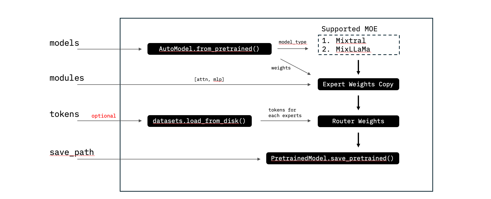

# Model Merging & Mixing

**Deciders(s)**:  Laura Wynter (lwynter@sg.ibm.com), Rhui Dih Lee (rhui.dih.lee@sg.ibm.com)
**Date (YYYY-MM-DD)**:  2024-04-12
**Obsoletes ADRs**:  
**Modified By ADRs**:  
**Relevant Issues**:

- [Summary and Objective](#summary-and-objective)
  - [Motivation](#motivation)
  - [User Benefit](#user-benefit)
- [Decision](#decision)
  - [Alternatives Considered](#alternatives-considered)
- [Detailed Design](#detailed-design)

## Summary and Objective

Adding the feature to create MOE model (mixtral, mixllama) from base models (mistral, llama).

### Motivation

- MOE models like Mixtral have been shown to perform better than larger models like LLaMa-70b.

- The creation of Mixtral-type models can be achieved at nearly-zero cost, by mixing multiple trained models (experts).

- Domain specialised models can outperform a larger generalist model ([MSResearch](https://arxiv.org/pdf/2309.09530.pdf)).

- We thus enable the rapid creation of MOE models from domain specialist models. These rapidly-created MOE can outperform the respective specialist models ([FAIR](https://arxiv.org/pdf/2403.07816.pdf) and our own tests show). 

- The mixed MOE can be used with no tuning. However, we propose minimally tuning the mixed MOE model's router using a small dataset, to further improve model quality at a tiny fraction of the full training cost.

### User Benefit

Users can create a mixed MOE model using their own already trained experts, and choose to tune the MOE model's router to further improve the quality if desired.

## Decision

Develop a mixing routine to create a mixed MOE model by mixing n models specified by the user. Users can specify `module_to_mix` from among `["ffn_layer", "q_proj"]`.
Mixtral and LLaMa architectures have been tested, more model types can be added.

### Alternatives Considered

- ([mergekit](https://github.com/arcee-ai/mergekit/blob/main/mergekit/scripts/mixtral_moe.py#L70)) proposes also creating a mixed MOE but does not offer a method to train the router. We find that our method provides superior results to that of mergekit.
Full finetuning of the mixed MOE model could improve the model further, however the cost would be considerably higher. In any case, the resulting model is provided to the user who can proceed to further tune as desired.

- Full finetuning of the mixed MOE model could improve the model further, however the cost would be considerably higher. In any case, the resulting model is provided to the user who can proceed to further tune as desired.

## Detailed Design
