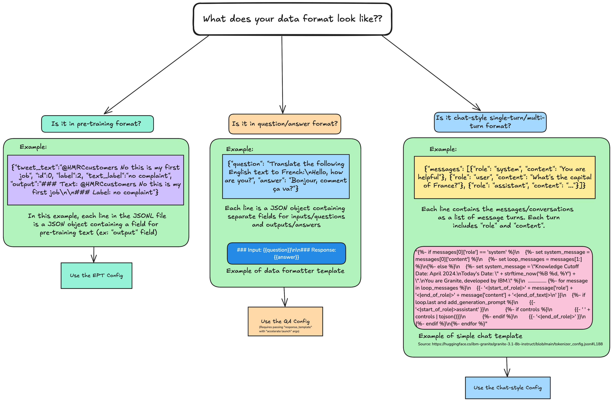

# Guidelines For Data Config Selection

This documentation outlines the recommended criteria and best practices for selecting the appropriate [data config](https://github.com/foundation-model-stack/fms-hf-tuning/blob/9ca5739a4f7c1f0c9446b28d1bb80939d4199a75/docs/advanced-data-preprocessing.md#data-config) based on the format and characteristics of the training data. Users can currently pass both YAML or JSON based configuration files as data_configs via `--data_config_path` flag.

## Scenarios tailored to different training data formats

 

Based on the structure of the training data, we have categorized it into three distinct scenarios, as illustrated in the hierarchical diagram above
- Pre-training format (EPT data)
- Question-Answer format
- Chat-style format (single-turn or multi turn)

The supported data file formats are jsonl, json, arrow, and parquet.

### Data config for pre-training format data

If you want to perform Extended Pretraining (EPT) on your training data, then use the below data config. For EPT, set `packing` as `true` in the tuning config.

```yaml
dataprocessor:
  type: default
  streaming: false
datasets:
  # Commenting sampling ratio will concatenate the datasets
  - name: dataset_1
    # sampling: 1.0
    data_paths:
      - "tests/artifacts/jsonl/twitter_complaints_small.jsonl"
    # Either the below data_handlers section can be used or the dataset_text_field in the tuning config can be used for specifying the field in the dataset that contains the training text for EPT.
    # In this sample ept_data, "output" field contains the text for training. Please change it according to your data.
    # If your data is already tokenized data, then comment the data handlers section
    data_handlers:
      - name: tokenize
        arguments:
          remove_columns: all
          batched: false
          fn_kwargs:
            text_column_name: "output"
            max_length: 4096
# If there are multiple datasets, add them in the data config as well.
  # - name: dataset_2
  #   # sampling: 1.0
  #   data_paths:
  #     - /path/to/the/dataset
  #   data_handlers:
  #     - name: tokenize
  #       arguments:
  #         remove_columns: all
  #         batched: false
  #         fn_kwargs:
  #           text_column_name: "text"
  #           max_length: 4096
```

Example training data:

```json
{"tweet_text":"@HMRCcustomers No this is my first job","id":0,"label":2,"text_label":"no complaint","output":"### Text: @HMRCcustomers No this is my first job\n\n### Label: no complaint"}

{"tweet_text":"@KristaMariePark Thank you for your interest! If you decide to cancel, you can call Customer Care at 1-800-NYTIMES.","id":1,"label":2,"text_label":"no complaint","output":"### Text: @KristaMariePark Thank you for your interest! If you decide to cancel, you can call Customer Care at 1-800-NYTIMES.\n\n### Label: no complaint"}
```

The key or field containing the training data can be specified using the `dataset_text_field` parameter in the `tuning config`. Alternatively, it may be defined using the `text_column_name` field within the `fn_kwargs` section of `data_handlers`. However, these two methods should not be used simultaneously. For multiple datasets, the data_handlers approach should be used to define the appropriate field for each dataset individually.

It is recommended to perform EPT on a base model. If the `tokenizer_config.json` file contains the `chat_template` field, the model is likely instruction-tuned for chat or instruction-following tasks; otherwise, it is most likely a base model.

If the dataset consists of pre-tokenized data, the `data_handlers` section should be omitted, and the `dataset_text_field` should not be specified.

### Data config for question-answer format data

If the training data is in format of question-answer/instruction-response, then use the below data config.

```yaml
dataprocessor:
  type: default
  streaming: false
datasets:
  # If there are more than one dataset, then commenting the sampling ratio will concatenate the datasets.
  - name: dataset_1
    # sampling: 1.0
    data_paths:
      - "tests/artifacts/jsonl/twitter_complaints_small.jsonl"
    # If your data is already tokenized data, then comment the data handlers section
    data_handlers:
      - name: apply_custom_jinja_template
        arguments:
          remove_columns: all
          batched: false
          fn_kwargs:
            formatted_text_column_name: "formatted_chat_data"
            template: "### Input: {{tweet_text}} \\\n\\\n### Response: {{text_label}}"
# If there are multiple datasets, add them in the data config as well.
```

Example training data:

```json
{"tweet_text":"@HMRCcustomers No this is my first job","id":0,"label":2,"text_label":"no complaint"}

{"tweet_text":"@KristaMariePark Thank you for your interest! If you decide to cancel, you can call Customer Care at 1-800-NYTIMES.","id":1,"label":2,"text_label":"no complaint"}
```

The template for formatting the data is specified in the `apply_custom_jinja_template`. In this case, the data formatting `template` is `### Input: {{tweet_text}} \\\n\\\n### Response: {{text_label}}`, and the `response template` is defined as `\\\n### Response:`. These templates can be modified as needed to align with the structure of the training dataset. Additionally, the value of `dataset_text_field` in the tuning config should match the `formatted_text_column_name` specified in the `fn_kwargs` section of `data_handlers`.

If the dataset consists of pre-tokenized data, the `data_handlers` section should be omitted, and the `dataset_text_field` and `response_template` parameters should not be specified.

### Data config for chat-style format data

If the training data is in a single-turn/multi-turn chat format, then use the below data config.

```yaml
dataprocessor:
  type: default
  streaming: false
  # This data config uses the chat template of the "ibm-granite/granite-3.1-8b-instruct" model for intruction-tuning of base model. If you want to modify the chat template you can edit the below chat template.
  # If your model is same instruct model then comment the chat template section.
  # If your model is a different instruct model (if the tokenizer_config.json file contains chat_template) other than "ibm-granite/granite-3.1-8b-instruct" model, then correct the below chat template with the model's chat template.
  chat_template: |
    
    
        
        
    
        {%- set system_message = "Knowledge Cutoff Date: April 2024.\nToday's Date: " + strftime_now('%B %d, %Y') + ".\nYou are Granite, developed by IBM." %}
        
            {%- set system_message = system_message + " You are a helpful AI assistant with access to the following tools. When a tool is required to answer the user's query, respond with <|tool_call|> followed by a JSON list of tools used. If a tool does not exist in the provided list of tools, notify the user that you do not have the ability to fulfill the request.\n\nWrite the response to the user's input by strictly aligning with the facts in the provided documents. If the information needed to answer the question is not available in the documents, inform the user that the question cannot be answered based on the available data." %}
        
            
        
            
        
                
        
        
            
        
        
            
        
        
    
    {{- '<|start_of_role|>system<|end_of_role|>' + system_message + '<|end_of_text|>\n' }}
    
        {{- '<|start_of_role|>tools<|end_of_role|>' }}
        {{- tools | tojson(indent=4) }}
        {{- '<|end_of_text|>\n' }}
    
    
        {{- '<|start_of_role|>documents<|end_of_role|>' }}
        
            {{- 'Document ' + loop.index0 | string + '\n' }}
            {{- document['text'] }}
            
                {{- '\n\n'}}
            
        
        {{- '<|end_of_text|>\n' }}
    
    
        {{- '<|start_of_role|>' + message['role'] + '<|end_of_role|>' + message['content'] + '<|end_of_text|>\n' }}
        
            {{- '<|start_of_role|>assistant' }}
                
                    {{- ' ' + controls | tojson()}}
                
            {{- '<|end_of_role|>' }}
        
    
    
datasets:
  # If there are more than one dataset, then commenting the sampling ratio will concatenate the datasets
  - name: dataset_1
    # sampling: 1.0
    data_paths:
      - "tests/artifacts/jsonl/multi_turn_chat_conversations.jsonl"
    # Comment the below data_handlers section if your data is already pre-tokenized data and contains the "input_ids", "labels", and "attention_mask".
    data_handlers:
      - name: tokenize_and_apply_chat_template_with_masking
        arguments:
          remove_columns: all
          fn_kwargs:
            max_seq_length: 4096
            conversation_column: "messages"
```

Example training data:

```json
{"messages": [{"content": "You are an AI language model developed by IBM Research. You are a cautious assistant. You carefully follow instructions. You are helpful and harmless and you follow ethical guidelines and promote positive behavior.", "role": "system"}, {"content": "Using the word \"grace\", come up with a word that rhymes and has the same number of syllables\n<nopace>", "role": "user"}, {"content": "Certainly! Here's a word that rhymes with \"grace\" and has the same number of syllables:\n1\\. Space", "role": "assistant"}, {"content": "Using the word \"grace\", come up with a word that rhymes and has the same number of syllables\n<nopace>", "role": "user"}, {"content": "Certainly! Here's a word that rhymes with \"grace\" and has the same number of syllables:\n1\\. Space", "role": "assistant"}], "group": "lab_extension", "dataset": "base/full-extension", "metadata": "{\"num_turns\": 2}"}

{"messages": [{"content": "You are an AI language model developed by IBM Research. You are a cautious assistant. You carefully follow instructions. You are helpful and harmless and you follow ethical guidelines and promote positive behavior.", "role": "system"}, {"content": "Tell me one word that rhymes and has the opposite meaning of \"open\".", "role": "user"}, {"content": "Sure! Here's a word that rhymes with \"open\" and has the opposite meaning:\n1\\. Shut", "role": "assistant"}, {"content": "Tell me one word that rhymes and has the opposite meaning of \"open\".", "role": "user"}, {"content": "Sure! Here's a word that rhymes with \"open\" and has the opposite meaning:\n1\\. Shut", "role": "assistant"}], "group": "lab_extension", "dataset": "base/full-extension", "metadata": "{\"num_turns\": 2}"}
```

For example if we want to perform instruction-tuning on the `granite-3.1-8b-base` model, which is a base (non-instruction-tuned) model, we provide the chat template from the "ibm-granite/granite-3.1-8b-instruct" model using the config's `dataprocessor.chat_template` parameter. Since the special tokens referenced in this chat template are not present in the base model by default, they should be added explicitly through the `add_special_tokens` field in the tuning config. 

If the model being used is already instruction-tuned, you should update or remove the `dataprocessor.chat_template` field from the data config and `add_special_tokens` field from the tuning config as appropriate, based on the `chat_template` and `additional_special_tokens` defined in the model’s `tokenizer_config.json`.

The `tokenize_and_apply_chat_template_with_masking` data handler is used to apply the chat template and tokenize the data. The `conversation_column` field in the data handler is used for specifying the key/field in the dataset that contains the conversation data, which is `messages` in the example training data provided above. You might need to update the `conversation_column` based on your dataset. As this data handler performs tokenization and generates the `input_ids`, `labels`, and `attention_masks` fields, it is not necessary to specify the `instruction_template` and `response_template` in the tuning config.

If the data is already tokenized, then all the `data_handlers` should be omitted or commented out.
